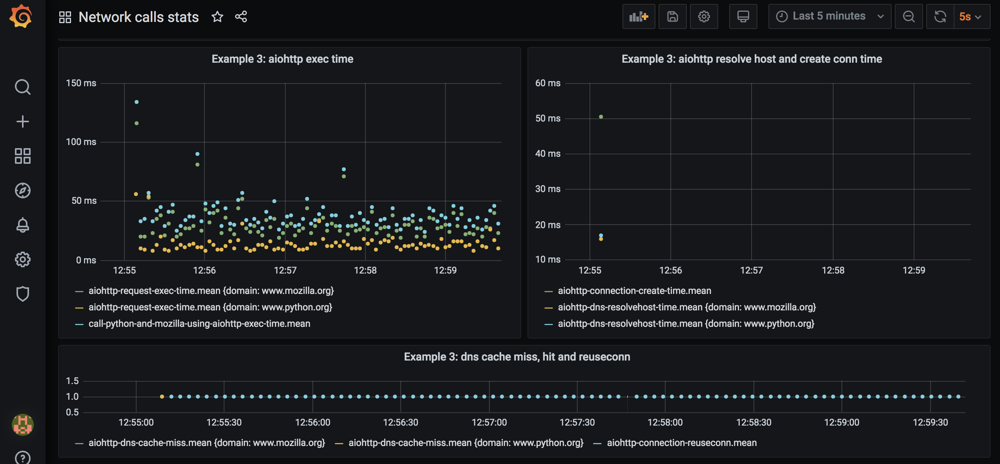
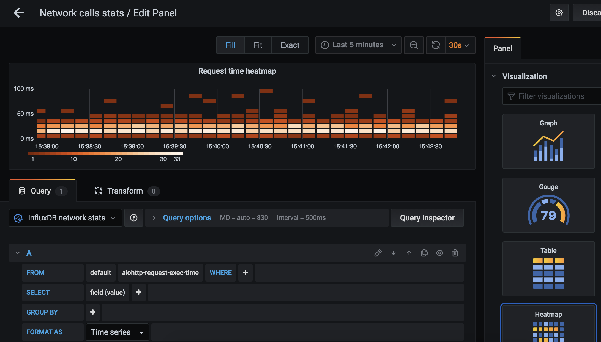

# Monitoring network calls in Python using TIG stack

Web applications and API endpoints are known to perform backend calls. Often that is all application does: fetches data from couple backends, combines it and produces response.

Monitoring how much time fetching data from backend took is essential. There are plenty production-ready buy-and-snap-on solutions that provide such monitoring, but they might be not good fit for some cases. And I think it's fun to dig deeper into things to get more understanding of how it all works.

Let's look at code examples that use popular Python networking libraries, and are instrumented to report HTTP request execution time.

### What I'm going to explore in this post

I'm going to compare how request timings look for fetching HTML pages using `requests` library and for asyncronously fetching same HTML pages using `aiohttp` library. I aim to visualize the difference in timings, and to introduce tools that can be used for such monitoring. 

To be fair, `requests` library has [plugins](https://github.com/spyoungtech/grequests) that enable asyncronous IO, and there's so many other ways to achieve this in Python... I picked `aiohttp` as it provides neat request timing tracing opportunities, and I use this library a lot in the wild.

To monitor request timings we will use [Telegraf](https://www.influxdata.com/time-series-platform/telegraf/), [InfluxDB](https://www.influxdata.com/products/influxdb/) and [Grafana](https://grafana.com/grafana) stack. These tools are very easy to setup locally, open source, free for personal usage, and could be used in production environment.

Chapter 'Running code examples' describes in detail how to run example code and setup monitoring infrastructure (Telegraf, InfluxDB, Grafana).

All code from this writing is available in [repo](https://github.com/CheViana/network-calls-stats/).

## Example 0: monitor `requests` request time

Let's dive into first Python code example. Here's what it does:
- in forever loop, executes two HTTP requests using `requests` Python library
- reports request time and request exceptions to Telegraf

Here's request execution time plotted on dashboard:


Full code of Example 0 can be found in [example-0-requests-send-stats.py](https://github.com/CheViana/network-calls-stats/blob/master/example-0-requests-send-stats.py).

High-level execution flow can be followed from `main` part of program:
```
if __name__ == '__main__':
    while True:
        result = call_python_and_mozilla_using_requests()
        print(result)
        time.sleep(3)
```

`call_python_and_mozilla_using_requests()` and pause 3 seconds, repeat foverer.

Inside `call_python_and_mozilla_using_requests` two simple HTTP requests are performed one by one, and their response text used to compose result:
```
def call_python_and_mozilla_using_requests():
    py_response = get_response_text('https://www.python.org/')
    moz_response = get_response_text('https://www.mozilla.org/en-US/')
    return (
        f'Py response piece: {py_response[:60].strip()}... ,\n'
        f'Moz response piece: {moz_response[:60].strip()}...'
    )
```

`get_response_text` function executes HTTP request for given URL, with primitive exception handling, and hook to report request execution time:
```
def profile_request(start_time, response, *args, **kwargs):
    elapsed_time = round((
        time.perf_counter() - start_time
    ) * 1000)
    send_stats(
        'requests_request_exec_time',
        elapsed_time,
        {'domain': URL(response.url).raw_host}
    )


def get_response_text(url):
    try:
        request_complete_callback = partial(
            profile_request,
            time.perf_counter()
        )
        response = requests.get(
            url,
            hooks={'response': request_complete_callback}
        )
        response.raise_for_status()
        return response.content.decode()
    except RequestException as e:
        send_stats(
            'requests_request_exception',
            1,
            {'domain': URL(url).raw_host, 'exception_class': e.__class__.__name__}
        )
        return f'Exception occured: {e}'
```

This code uses `requests` library ([docs](https://requests.readthedocs.io/en/master/)). Basic usage to get text content from URL is following:
```
response = requests.get(url).content.decode()
```

`requests.get` accepts optional `hooks` argument, where function to be called after request is completed is specified - `request_complete_callback`. 

This callback function may look funny if you're not familiar with functional programming. `partial(profile_request, time.perf_counter())` is itself a function. It's same function as `profile_request` but first argument is already filled in - `time.perf_counter()` passed as `start_time` argument. This trick is used to supply correct `start_time` for each request, as `request_complete_callback` function is constructed anew for each request, while code for sending request execution time is isolated in another function `profile_request`. We can rewrite that as follows:

```
def get_response_text(url):
    try:
        start_time = time.perf_counter()
        def profile_request(response, *args, **kwargs):
            elapsed_time = round((time.perf_counter() - start_time) * 1000)
            send_stats('requests_request_exec_time', elapsed_time, ...)
        response = requests.get(url, hooks={'response': profile_request})
```

And it's going to work alright. Now there's a function defined inside a function, and `get_response_text` is bloated with profiling stuff, which is not something I like.

 Read more about [partial functions](https://en.wikipedia.org/wiki/Partial_application) and [Python functools](https://docs.python.org/3/library/functools.html).

`time.perf_counter()` is used to measure execution time in Python, [docs](https://docs.python.org/3/library/time.html#time.perf_counter). `time.perf_counter()` returns microseconds. 


### Sending stats

`send_stats` function is used to report measurement to Telegraf: metric name is `'requests_request_exec_time'`, metric value is time request execution took, tags include additional useful information (domain of URL).
`get_response_text` also invokes `send_stats` when exception occurs, passing different metric name this time - `'requests_request_exception'`.

I have [another post](https://dev.to/cheviana/reporting-measurements-from-python-code-in-real-time-4g5) that describes ways to send stats from Python program to Telegraf.

In short, `send_stats` accepts metric name, metric value and tags dictionary. Those are converted to one string, and sent to socket on which Telegraf listens for measurement data. Telegraf sends received metrics to database (InfluxDB). Grafana dashboard queries database to put a dot on graph for each metric value reported.


### `profile` decorator

A piece of code which is decorator suitable for any function (async, sync, method of class or pure function) is adapted here to measure execution time of function that is decorated. 
`profile` decorator is used to profile total execition time of functions `call_python_and_mozilla_using_requests` and `call_python_and_mozilla_using_aiohttp` (following examples).
Don't confuse with another useful tool - [line_profiler](https://github.com/rkern/line_profiler) - that also provides `profile` decorator.

### Results on dashboard

Let's run this example and setup all the monitoring tools (See chapter 'Running code examples' below on how to run example code and setup monitoring infrastructure).

We can configure a panel that shows request execution time:


Blue dots of total execution time roughly correspond to sum of time request to `python.org` and request to `mozilla.org` took (green and yellow dots), and measures at approximately 150 msec on average.

### Need more exceptions

If we change 'www.python.org' to 'www.python1.org' in function `call_python_and_mozilla_using_requests`, exceptions appear in terminal output, and exception metrics are sent to Telegraf:
```
    Reported stats: aiohttp_request_exception=1, tags={'domain': 'www.python1.org', 'exception_class': 'ClientConnectorError'}
    'Py response piece: ...Exception occured: Cannot conn... 
```

Configure separate Grafana panel to see exceptions on dashboard:


Exception class is sent as tag along with metric value. This gives us ability to plot different lines for exceptions of different classes. To achieve this, pick 'group by - tag(exception_class)' when editing request exceptions panel.


### Example 0 improved: reuse connection

Code of example 0 can be improved to reuse same connection for all calls performed in that forever running `while` loop - here's [improved version](https://github.com/CheViana/network-calls-stats/blob/master/example-0-plus-requests-reuse-conn.py).

Signifact code change is this one:
```
...
session = requests.Session()
while True:
    result = call_python_and_mozilla_using_requests(session)
...
```
Connection creation is moved out of `while` loop, now connection is established once and for all.

Let's compare how much time request execution takes when connection is reused:


On the left are dots-measurements for original version of Example 0, on the right - for improved version. Can definitely notice how total execution time get lower, below 100 msec on average. 


## Example 1: monitor `aiohttp` request time

Let's dive into next code example. Here's what it does:
- in forever loop, executes two asyncronous HTTP requests using `aiohttp`
- hooks into `aiohttp` request lifecycle signals
- reports request time and request exceptions to Telegraf

Here's execution time results on dashboard:


Full code of Example 1 can be found in [example-1-aiohttp-send-stats-basic.py](https://github.com/CheViana/network-calls-stats/blob/master/example-1-aiohttp-send-stats-basic.py).

High-level execution flow is similar to the Example 0, the way content is fetched from URLs differs.

### The tale of two HTTP requests

Let's start with function `call_python_and_mozilla_using_aiohttp` that executes two asyncronous HTTP requests and returns pieces of response content (the twin of `call_python_and_mozilla_using_requests` from Example 0):

```
async def get_response_text(url):
    try:
        async with ClientSession(trace_configs=[Profiler()]) as session:
            async with session.get(url) as response:
                response.raise_for_status()
                return await response.text()
    except ClientError as e:
        return f'Exception occured: {e}'

@profile
async def call_python_and_mozilla_using_aiohttp():
        py_response, moz_response = await asyncio.gather(
            get_response_text('https://www.python.org/'),
            get_response_text('https://www.mozilla.org/en-US/')
        )
        return (
            f'Py response piece: {py_response[:60].strip()}... ,\n'
            f'Moz response piece: {moz_response[:60].strip()}...'
        )
```

Here `aiohttp` library's `ClientSession` is used to execute request ([docs](https://docs.aiohttp.org/en/stable/client.html)). Basic usage to get text content from URL is following:
```
async with ClientSession() as session:
    async with session.get(url) as response:
        return await response.text()
```

Which is basically what happens in `get_response_text`. `get_response_text` also calls `response.raise_for_status()` which raises exception when response status code is error code or timeout occurs . Exception is silenced in `get_response_text`, so `get_response_text` always returns `str`, either with response content or with exception message.

`call_python_and_mozilla_using_aiohttp` takes care of callings two URLs using `asyncio.gather`. Execution order is following:

Request to python.org is sent --> Request to mozilla.org is sent --> wait for either one of requests to complete --> first response is received --> second response is received

`await asyncio.gather` returns result after both requests are complete.

Total execution time is approximately the time of the longest request out of these two. You're probably aware that this is called non-blocking IO: IO operation frees execution thread, until it needs it again, instead of blocking.

Traditional (like in Example 0), syncronous, blocking IO, has following execution order:

Request to python.org is sent --> wait for it to complete --> python.org response is received --> mozilla.org request is sent --> wait for it to complete --> mozilla.org response is received

Total execution time is approximately the sum of both requests execution time. For positive integers, it's always true that `A + B > MAX(A, B)`, hence asyncronous execution takes less time than syncronous. Provided unlimited CPU was made available to Python program in both cases, async and sync.

On panel that shows requests execition time and their total execution time, it's possible to notice that total execution time `call_python_and_mozilla_using_aiohttp_exec_time` almost matches the longer-executing request time:


Total execution time for both requests is 75-100 msec.

Next we're going to look at how execution time of each `aiohttp` request is reported.


### `aiohttp` requests signals

`aiohttp` provides a way to execute custom function when HTTP request execution progresses through lifecycle stages: before request is sent, when connection is established, after response chunk is received, etc.

For that object-tracer is passed to `aiohttp.ClientSession` - `trace_configs`:
```
class Profiler(TraceConfig):
    def __init__(self, *args, **kwargs):
        super().__init__(*args, **kwargs)
        self.on_request_start.append(on_request_start)
        self.on_request_end.append(on_request_end)
        self.on_request_exception.append(on_request_exception)

...
async with ClientSession(trace_configs=[Profiler()]) as session:
...
```

`Profiler` is subclass of `aiohttp.TraceConfig`. It "hooks up" functions that are going to be executed when request starts (`on_request_start`), when it ends (`on_request_end`), and when request exception is encountered (`on_request_exception`):
```
async def on_request_start(session, trace_config_ctx, params):
    trace_config_ctx.request_start = asyncio.get_event_loop().time()

async def on_request_end(session, trace_config_ctx, params):
    elapsed_time = round((
        asyncio.get_event_loop().time() - trace_config_ctx.request_start
    ) * 1000)
    send_stats(
        'aiohttp_request_exec_time',
        elapsed_time,
        {'domain': params.url.raw_host}
    )

async def on_request_exception(session, trace_config_ctx, params):
    send_stats(
        'aiohttp_request_exception',
        1,
        {'domain': params.url.raw_host, 'exception_class': params.exception.__class__.__name__}
    )
```

Notice how timestamp is computed:
```
asyncio.get_event_loop().time()
```
It is recommended to use event loop’s internal monotonic clock to compute timedeltas in asyncronous code.

Function-hooks have arguments `session, trace_config_ctx, params`. Let's look at what they are.

`session` is instance of `aiohttp.ClientSession`.

`trace_config_ctx` is context that is passed through callbacks. Custom values call be added to it when request is made:
```
await session.get(url, trace_request_ctx={'flag': 'red'})
...

async def on_request_end(session, trace_config_ctx, params):
    if trace_config_ctx.trace_request_ctx['flag'] == 'red':
        ....
```
This way function-hook can be programmed to behave differently for different request calls or to report additional data.

Request end hook uses `trace_config_ctx.request_start` value to compute total time request took. `trace_config_ctx.request_start` is set in request start hook.

`params` argument in `on_request_end` is `aiohttp.TraceRequestEndParams` and as such has `url` property. `url` property is of `yarl.URL` type. `params.url.raw_host` returns domain of URL which was requested. Domain is sent as tag for metric, and this makes it possible to plot separate lines for different URLs.


### Main thing

When script is launched from command line, following code fires:
```
async def main_async():
    while True:
        result = await call_python_and_mozilla_using_aiohttp()
        print(result)
        await asyncio.sleep(3)
```

This will call `call_python_and_mozilla_using_aiohttp`, then sleep 3 seconds. Then call again, forever. Until program is stopped. Similar to Example 0.

To call async function in sync execution context special tooling is used, which is adapted from [another publication](https://www.roguelynn.com/words/asyncio-graceful-shutdowns/). I'm not going to dive into Python's asyncronous ways in this post. Read more about Python's [asyncio](https://python.readthedocs.io/en/latest/library/asyncio.html), it's pretty cool.


### Compare results for Example 0 and 1


Connection is not reused for both cases here. Execution time for async version is lower, as expected.


## Example 2: more, more stats

`aiohttp` provides hooks to measure more than just request execution time and request exceptions.

It's possible to report stats for:
- DNS resolution time
- DNS cache hit/miss
- waiting for available connection time
- connection establishing time
- connection being reused
- redirect happening
- response content chunk received
- request chunk sent

Impressive, isn't it? Documentation on tracing in `aiohttp` is [here](https://docs.aiohttp.org/en/stable/tracing_reference.html).

Let's add more request lifecycle hooks:

```
class Profiler(TraceConfig):
    def __init__(self, *args, **kwargs):
        super().__init__(*args, **kwargs)
        self.on_request_start.append(on_request_start)
        self.on_request_end.append(on_request_end)
        self.on_request_redirect.append(on_request_redirect)
        self.on_request_exception.append(on_request_exception)
        self.on_connection_queued_start.append(on_connection_queued_start)
        self.on_connection_queued_end.append(on_connection_queued_end)
        self.on_connection_create_start.append(on_connection_create_start)
        self.on_connection_create_end.append(on_connection_create_end)
        self.on_dns_resolvehost_start.append(on_dns_resolvehost_start)
        self.on_dns_resolvehost_end.append(on_dns_resolvehost_end)
        self.on_response_chunk_received.append(on_response_chunk_received)
        self.on_connection_reuseconn.append(on_connection_reuseconn)
        self.on_dns_cache_hit.append(on_dns_cache_hit)
        self.on_dns_cache_miss.append(on_dns_cache_miss)
```

I won't bore you with code for each function like `on_dns_resolvehost_end`, it's quite similar to `on_request_end`. Full code of Example 2 is [here](https://github.com/CheViana/network-calls-stats/blob/master/example-2-aiohttp-send-more-stats.py).

Reported stats on dashboard for example 2:


We can see that DNS resolution takes couple of milliseconds and happens for every call, and connection establishing takes 30-40 msec and happens for every call. Also, that DNS cache is not hit, DNS is resolved for every call.

We can definitely improve on that - in Example 3.

## Example 3: `aiohttp` reuse session

Let's modify Example 2 code so that `ClientSession` is created once, outside `while` loop:
```
async def main_async():
    async with ClientSession(trace_configs=[Profiler()]) as session:
        while True:
            result = await call_python_and_mozilla_using_aiohttp(session)
            print(result)
            await asyncio.sleep(3)
```

And check out how stats look now:


There's only one dot for connection establishing, and one per DNS resoltion per domain. There's plenty of dots for connection reuse event.
Total execution time is below 50 msec. Cool.

Full source code of Example 3 is [here](https://github.com/CheViana/network-calls-stats/blob/master/example-3-aiohttp-reuse-session.py).


## Compare sync and async URL fetch, with and without reusing connection

Total time for both requests (very approximate):

|  | Connection not reused | Connection reused |
| --- | --- | --- |
| Sync | 150 msec | 80 msec |
| Async | 80 msec | 40 msec |


## Bonus: histogram of request time


Grafana panel can not only plot line graphs, but also:
- show last reading of metric
- show table of metric values
- show bar plots
- show heatmaps (histogram over time)

Heatmap is helpful for quickly getting understanding what is distribution of backend response time: it can be the case that most requests complete in under 50 msec, but some requests are slow and complete in >500 msec. Average request time doesn't show this information. In previous examples, we're plotting just the average.

We can easily add heatmat for request execution time:



Need to add new panel, pick measurement details, and select "Heatmap" in "Visualization" collapsible in the right column.
Each 10 seconds new set of bricks is appears panel, each brick's color represents how much measurements fall into that value bucket (e.g. 10msec-20msec). Can set fixed bucket size or fix amount of buckets, or let default values do their magic.

In case Telegraf sends all metrics data to InfluxDB, that's a real heatmap. Telegraf is often configured to send only aggregated values to database (min, avg, max) calculated over short period of time (10sec), to reduce metrics reporting traffic. Heatmap based on such aggregated value is not a real heatmap.

It is possible to configure [histogram aggregate](https://github.com/influxdata/telegraf/tree/master/plugins/aggregators/histogram) in Telegraf config ([full Telegraf config with histogram aggregator](https://github.com/CheViana/network-calls-stats/blob/master/telegraf-histogram.conf)):
```
[[aggregators.histogram]]
  period = "30s"
  drop_original = false
  reset = true
  cumulative = false

  [[aggregators.histogram.config]]
    buckets = [1.0, 10.0, 12.0, 14.0, 16.0, 18.0, 20.0, 30.0, 40.0]
    measurement_name = "aiohttp-request-exec-time"
    fields = ["value"]
```
I set `reset=true` and `cumulative=false` which will cause buckets values to be calculated anew for each 30 second period. Need to set value ranges (`buckets`) manually, as well as specify correct `measurement_name`. If `fields` is not specified, histogram buckets are computed for all fields of measurement. Here's how bucket values appear in InfluxDB:


Amount of request execution times that falls in bucket is saved under "value_bucket" field name, "gt" and "le" are bucket range values that appear as tags.

Let's plot these values using "Bar gauge" panel visualization type:


Let's create 2 separate panels, one for python.org stats and one for mozilla.org (add 'where domain = python.org' in query edit).

Now we can at glance compare last 30 sec request execution time distribution for python.org and for mozilla.org:


## Running code examples

### Prerequirements: Python3

Install Python3: https://docs.python-guide.org/starting/install3/.

Make sure when you run
```
python --version
```

It prints out 'python3.' (could be 'python3.9', or 'python3.7', etc).

### Prerequirements: Install and launch Telegraf, InfluxDB, Grafana

To install all tools for MacOS:

    > brew install influxdb  <-- Database for metrics
    > brew install telegraf  <-- agent-collector of metrics
    > brew install graphana  <-- UI for metrics exploration and plotting

To download all tools binaries for Linux:

    > wget https://dl.influxdata.com/influxdb/releases/influxdb-1.8.2_linux_amd64.tar.gz
    > tar xvfz influxdb-1.8.2_linux_amd64.tar.gz
    > wget https://dl.influxdata.com/telegraf/releases/telegraf-1.15.2_linux_amd64.tar.gz
    > tar xf telegraf-1.15.2_linux_amd64.tar.gz
    > wget https://dl.grafana.com/oss/release/grafana-7.1.4.linux-amd64.tar.gz
    > tar -zxvf grafana-7.1.4.linux-amd64.tar.gz

Visit https://portal.influxdata.com/downloads/ for more information on how to install InfluxDB and Telegraf.
Visit https://grafana.com/grafana/download for more information on how to install Grafana.

Run Telegraf, InfluxDB, Grafana (each in it's own shell tab):

```
influxd -config /usr/local/etc/influxdb.conf
```

```
cd grafana-7.1.0/
bin/grafana-server
```

```
telegraf -config telegraf.conf
```
File telegraf.conf can be found in [here](https://github.com/CheViana/network-calls-stats/blob/master/telegraf.conf).

To see results on dashboard need to keep Telegraf, InfluxDB, Grafana running while Python scripts are running.

### Examples repository

Checkout [repository](https://github.com/CheViana/network-calls-stats/) with code examples and Telegraf configuration files.

### Python dependencies

It's best to create virtual environment to keep dependencies of project isolated from system Python packages, and dependencies of other projects. For that, I suggest to use [virtualenv](https://virtualenv.pypa.io/en/latest/installation.html) and [virtualenvwrapper](https://virtualenvwrapper.readthedocs.io/en/latest/install.html). Need to install these tools if you don't have them installed already.

Create virtual environment using `virtualenvwrapper`:
```
mkvirtualenv network-calls-stats
```

Create virtual environment using only `virtualenv`:
```
virtualenv venv
source venv/bin/activate
```

Install libraries needed to run example code from repo:
```
pip install -r requirements.txt
```

### Run example Python scripts

Provided previuos steps were performed (python installed, virtualenv created, dependencies pip-installed), it's easy to run example program:
```
python example-1-aiohttp-send-stats-basic.py
```

There should appear output in terminal:
```
(network-calls-stats) ➜  network-calls-stats git:(master) ✗ python example-1-aiohttp-send-stats-basic.py
Reported stats: aiohttp_request_exec_time=58, tags={'domain': 'www.python.org'}
Reported stats: aiohttp_request_exec_time=76, tags={'domain': 'www.mozilla.org'}
Reported stats: call_python_and_mozilla_using_aiohttp_exec_time=90, tags={}
Py response piece: <!doctype html>
<!--[if lt IE 7]>   <html class="no-js ie6 l... ,
Moz response piece: <!doctype html>

<html class="windows x86 no-js" lang="e...
```

### Get measurements appearing on dashboard

To view reported request time stats on dashboard, need to setup datasource and panels in Grafana.

Navigate to grafana dashboard in browser (http://localhost:3000/). Add new data source:


This data source should be used when configuring panels.

Let's create new dashboard for network stats, and add a panel to it.
Go to "Dashboards" in left side thin menu (icon looks like 4 bricks), pick "Manage", click on "New dashboard". Click "New panel" or "Add panel" in top right corner.
Pick "Edit" in dropdown next to new panel title.
Here's how to configure panel for Example 1:


Need to pick data source in the left corner of "Query" tab (center of screen) and provide measurement name in query editing section. To update panel name look in the right column on top.

To make Y axis values display with "ms", look in the right side column - "Panel" tab, "Axes" collapsible, "Left Y" - select "Time" and "milliseconds":


Don't forget to save. More [documentation](https://grafana.com/docs/grafana/latest/panels/add-a-panel/) on Grafana dashboards.


### Troubleshooting Telegraf, InfluxDB, Grafana

I've got some hints on what to check and how to check in [this post](https://dev.to/cheviana/reporting-measurements-from-python-code-in-real-time-4g5#troubleshooting).

[Full Grafana dashboard JSON](https://github.com/CheViana/network-calls-stats/blob/master/grafana-model.json) can be used to compare panel settings.